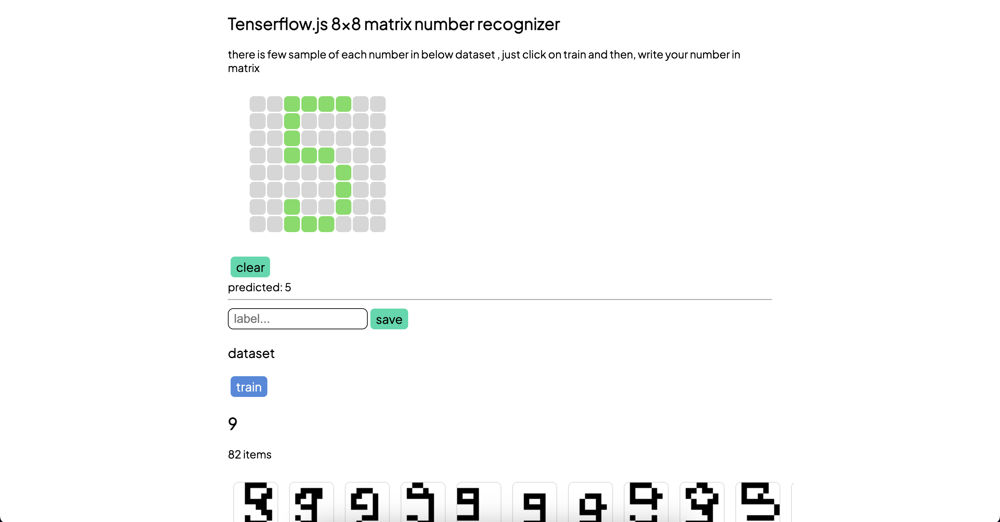

# Tensorflow js matrix number recognizer

> note: some numbers may not have good accurecy in prediction , i didn't optimized it , maybe with more number samples we get better result

Demo: https://amirrezasalimi.github.io/tensorflowjs-matrix-number-recognizer/
